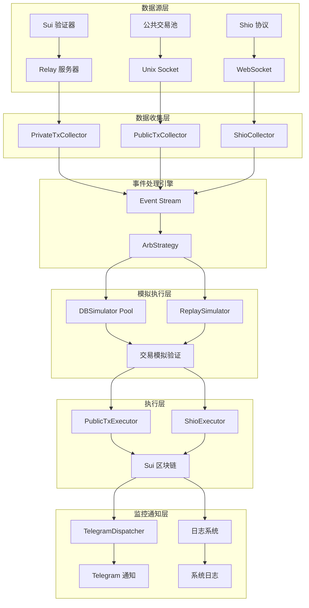
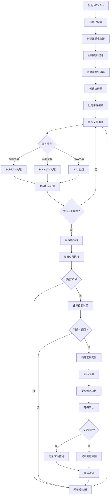
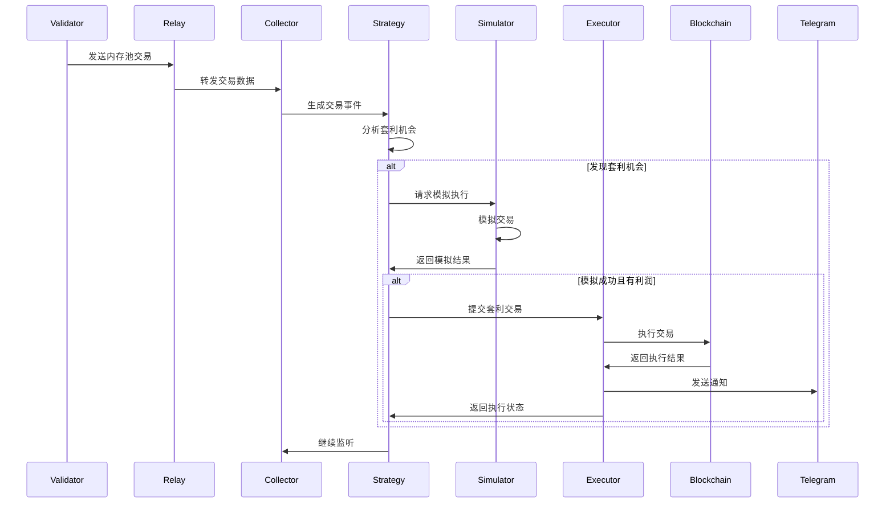
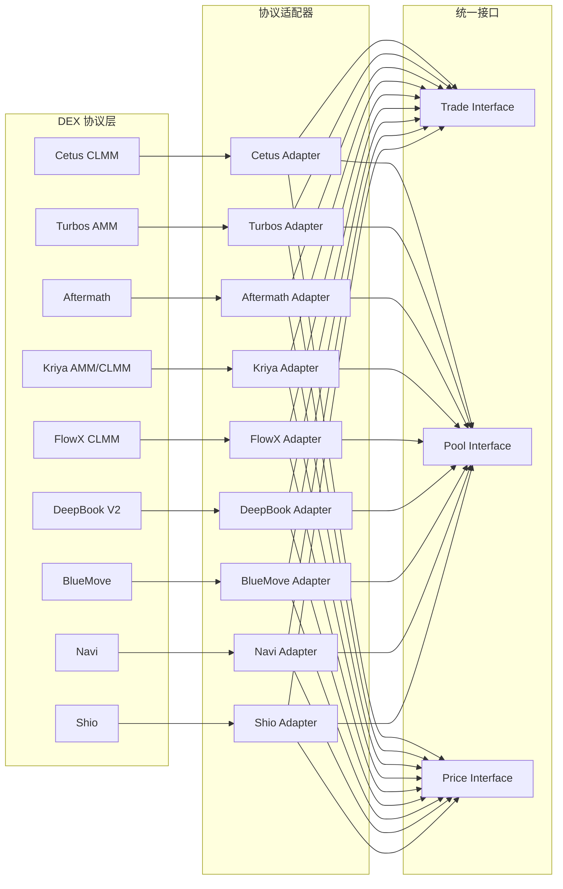
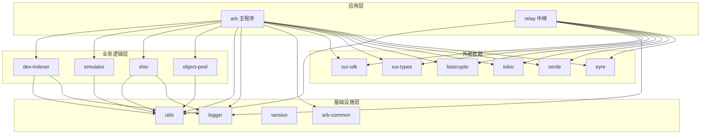
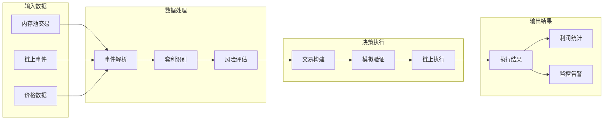
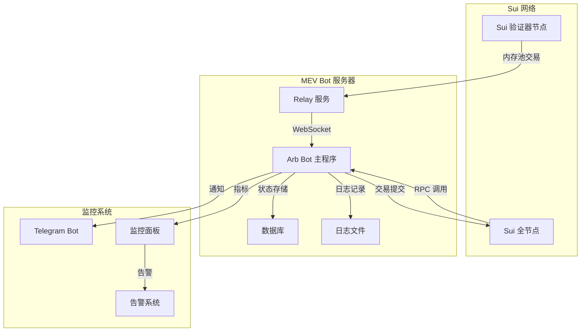
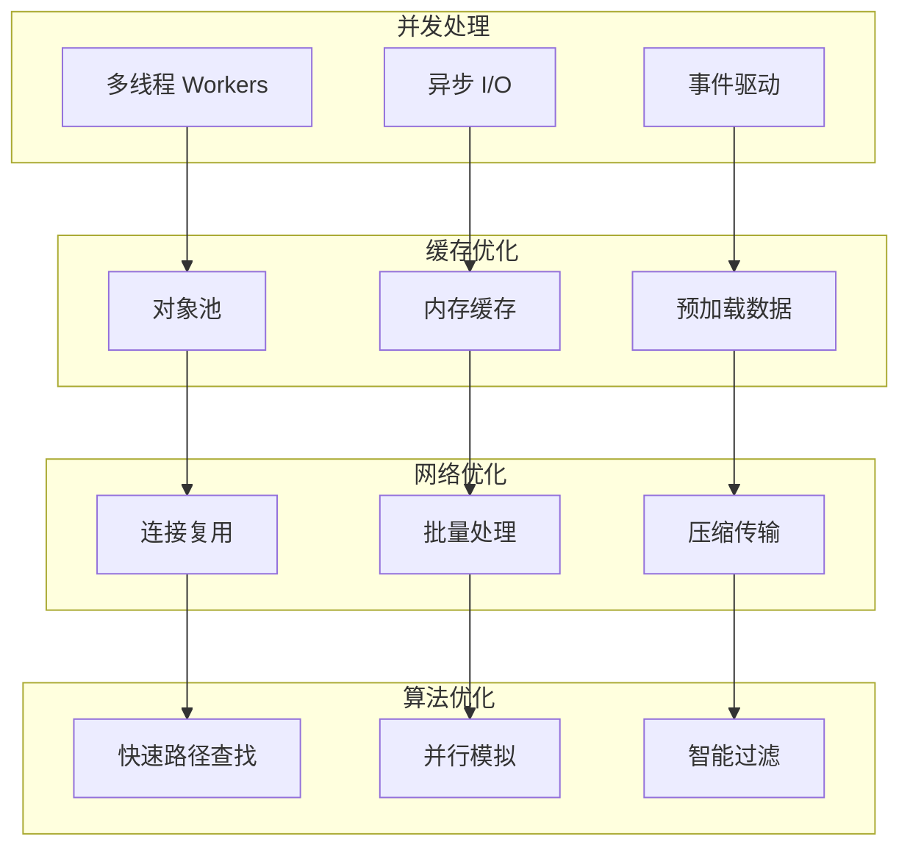

# Sui MEV Bot - 架构设计文档

## 概述

Sui MEV Bot 是一个高性能的套利机器人系统，专门设计用于在 Sui 区块链上捕获 MEV（Maximal Extractable Value）机会。系统采用模块化架构，支持多种 DEX 协议和数据源。

## 系统架构图

## 程序流程图

## 组件交互图

## DEX 协议支持架构

## 依赖关系图

## 数据流图

## 部署架构图

## 性能优化架构

## 总结

本架构文档详细描述了 Sui MEV Bot 的各个组件和它们之间的关系。系统采用分层架构设计，具有良好的模块化、可扩展性和高性能特征。通过这些图表，开发者可以快速理解系统的整体架构和工作原理，便于后续的开发和维护工作。