# Sui MEV Bot - 开发指南

## 开发环境设置

### 系统要求
- Ubuntu 22.04 或更高版本
- Rust 1.70+ 
- Node.js 22+
- Python 3.11+

### 开发工具链
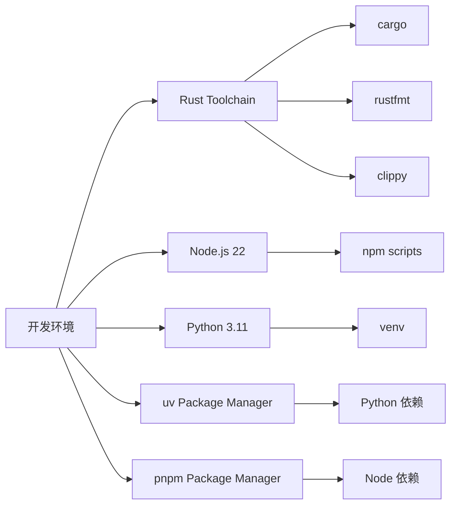

## 代码组织结构

### 模块依赖关系
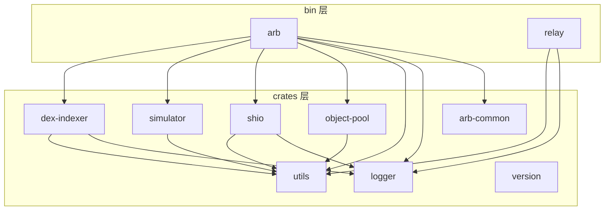

## 核心组件开发流程

### 1. 数据收集器开发流程
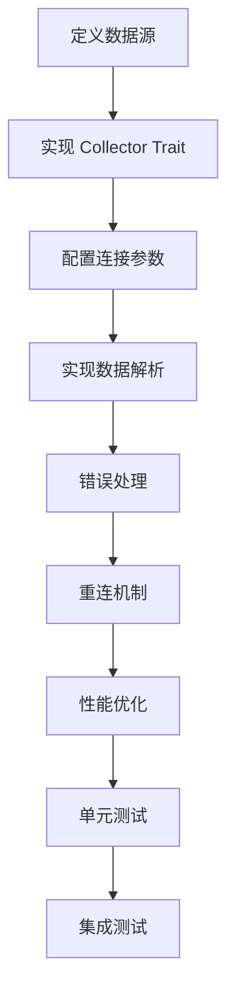

### 2. DEX 协议集成流程
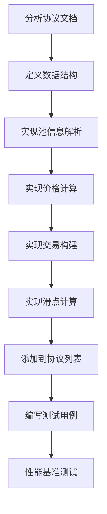

### 3. 策略开发流程
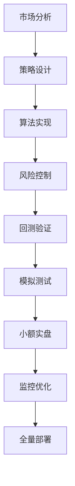

## 套利算法原理图

### 三角套利检测
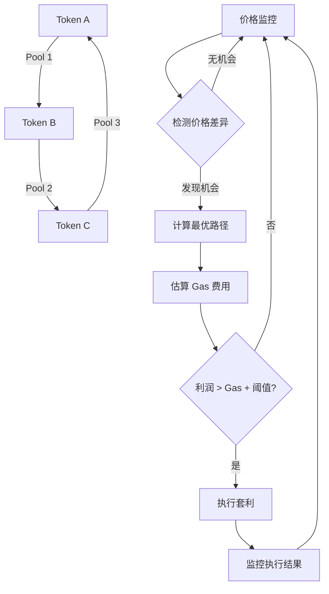

### 跨 DEX 套利检测
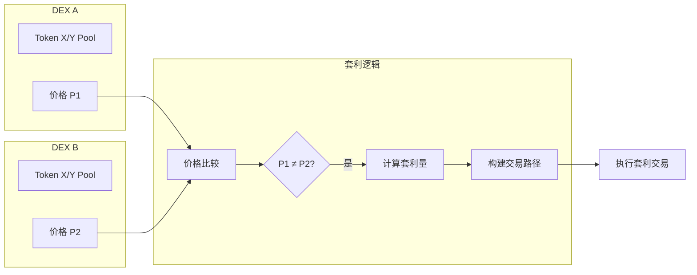

## 交易执行时序图

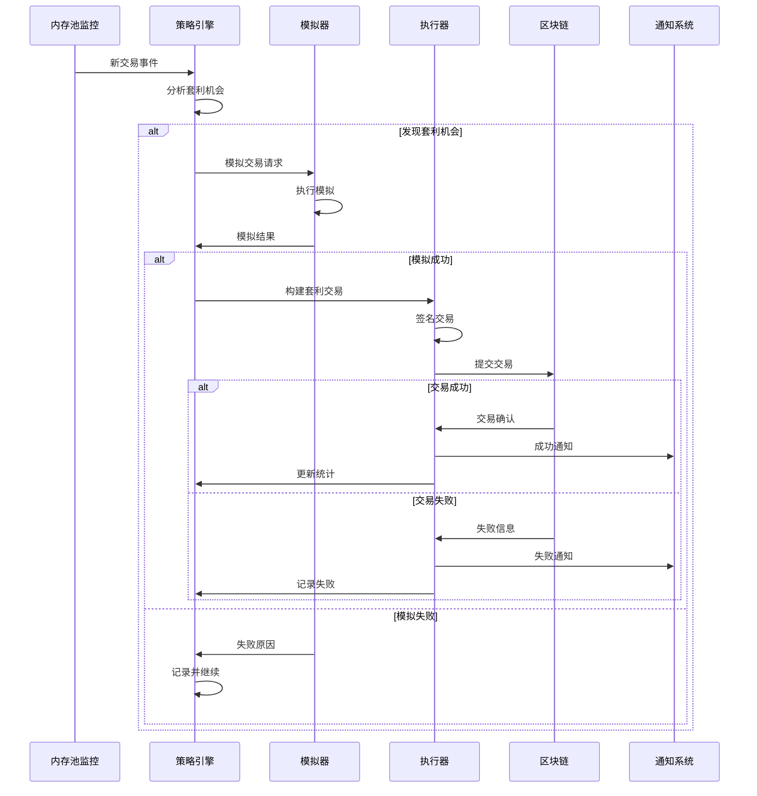

## 错误处理流程图

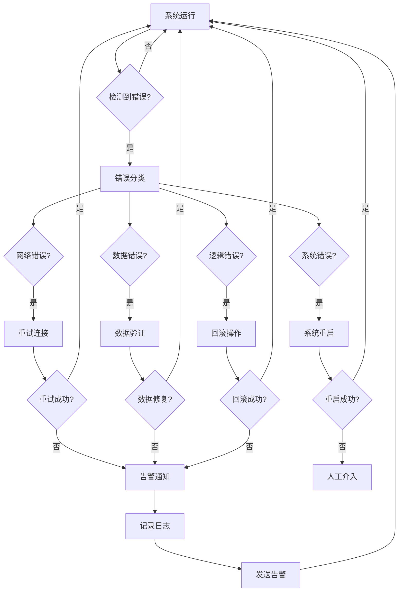

## 性能监控架构

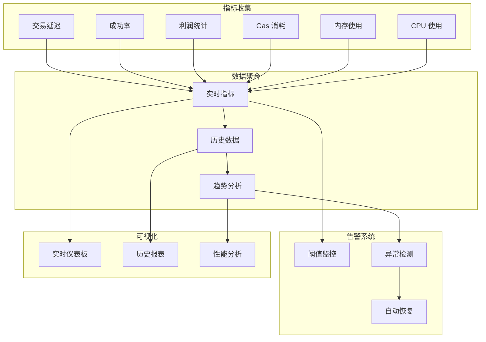

## 配置管理流程

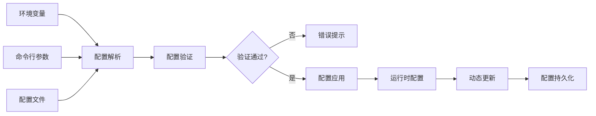

## 测试策略图

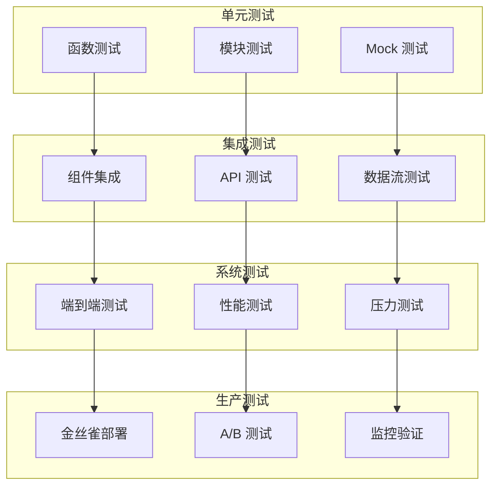

## 部署流程图

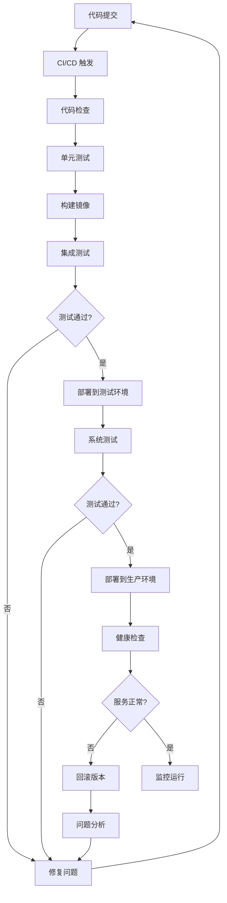

## 开发最佳实践

### 代码规范
1. **Rust 代码风格**：遵循 `rustfmt` 配置
2. **错误处理**：使用 `eyre` 进行错误管理
3. **异步编程**：合理使用 `tokio` 和 `async/await`
4. **日志记录**：使用结构化日志，包含必要的上下文信息

### 性能优化
1. **内存管理**：使用对象池减少内存分配
2. **并发处理**：合理设置工作线程数量
3. **网络优化**：复用连接，批量处理
4. **算法优化**：使用高效的数据结构和算法

### 安全考虑
1. **私钥管理**：使用环境变量，避免硬编码
2. **输入验证**：严格验证所有外部输入
3. **权限控制**：最小权限原则
4. **审计日志**：记录所有关键操作

## 故障排查指南

### 常见问题诊断流程
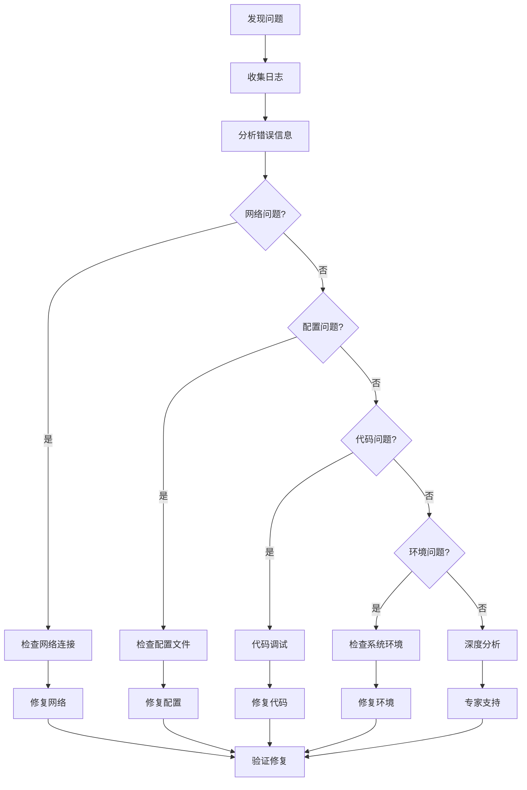

这个开发指南为 Sui MEV Bot 项目提供了全面的开发流程和最佳实践指导，帮助开发者快速上手和高效开发。